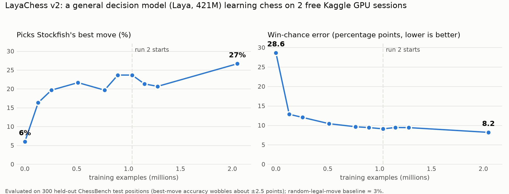

# I Taught a Decision Model to Play Chess Over a Weekend

*A 421M-parameter model that had never seen a chessboard, two million Stockfish opinions, free GPUs, and one very humbling fish.*



## It started on a Thursday

I was at work, I had half a day left, and I had just fallen into a rabbit hole about decision models. These are models that don't write you an essay. You give them a situation and a question with some options, and they tell you how likely each option is to be right. That's it.

Two of them looked interesting. Jev from TypeSafe AI is a closed API, and I didn't have a key, so that settled that. Laya from Convai Innovations is open source under Apache 2.0, runs on a 421M-parameter ModernBERT-large, and ships with a notebook for fine-tuning on Kaggle's free GPUs.

And chess is basically one long decision problem. Here's the board, here are your legal moves, pick one. You can't even make an illegal move, because you only ever offer it legal ones. So by Thursday evening the plan was simple: teach Laya chess, compare it with real engines, and do it before Monday. On free GPUs.

It wasn't simple. But it worked, mostly.

## What does Laya know about chess out of the box?

Nothing, it turns out.

I asked base Laya for an opening move as White and it picked b4. As Black against 1.e4 it played h6. Then I set up Scholar's Mate, the position where White can play Qxf7 and win on the spot, and it preferred the quiet little pawn move d3.

On a set of positions it had never seen, it picked Stockfish's best move 6% of the time. A random legal move gets you about 3%. So it was roughly twice as good as a coin flip, with a lot more electricity.

## Not labeling a million positions myself

My first plan was to take games from Lichess, run Stockfish on a million positions overnight, and label every move myself. My laptop did not love this plan, and neither did I.

Then I found out DeepMind had already done it, just slightly bigger. For their "searchless chess" paper they released ChessBench: 15.3 billion position and move pairs, each with Stockfish's win probability attached. Every legal move, already scored.

The catch is that it's stored in a custom .bag format that you normally read through Apache Beam. I didn't want Apache Beam in my weekend, so I looked at how the files are laid out. It's just records stored back to back, with a list of byte offsets at the end. Each record is a position, a move and a win chance. About thirty lines of Python later I had my own reader.

I obviously couldn't use all 15 billion examples. At the speed I ended up training, that would have taken around 120 years of free Kaggle quota. I took the test set and two of the training files instead, about 3.2 GB, and had Kaggle download them straight into a dataset so none of it went through my laptop.

## How do you ask a decision model about chess?

Laya likes questions with options, so that's what it gets. For every legal move it sees something like this:

*"black plays Rg4 (rook g6-g4). Win chance for black?"*

The options are ten win-chance levels, 0 to 10%, 10 to 20%, and so on up to 100%. The board goes in as context, written out as piece lists:

```
{"to_move": "black",
 "white": "Kg1 Qc5 Rd1 Rf1 Bc4 Pf2 Pg2 Ph2 Pe3 Pb4 Pa5",
 "black": "Kg8 Qe5 Rg6 Re8 Nd5 Pa6 Pc6 Ph6 Pb7 Pf7 Pg7",
 "castling": "-", "en_passant": "-"}
```

Laya spreads its confidence over the ten levels, I take the average, and that's the move's win chance. To actually play, I score every legal move and pick the best one.

This is the same idea DeepMind found worked best in their paper: judge each move by how good the position is after you play it. The difference is that my model isn't a transformer built for chess. It's a general decision model answering in its own question format.

My first version wrote the board out as an 8x8 grid and used sixteen levels instead of ten. That came to 335 tokens per question and trained at about 49,000 examples an hour. Switching to piece lists and ten levels brought it down to around 194 tokens and doubled the speed to about 97,000 an hour. Same idea, half the words. Models apparently like short questions as much as people do.

## Training on free GPUs, or: the crash compilation

Kaggle gives you two NVIDIA T4s, around 30 GPU hours a week, and a 12-hour limit per run. Here's roughly how my weekend went.

The first crash was a StopIteration error from inside ModernBERT. I was splitting each batch across both GPUs with PyTorch's DataParallel, and the model tried to figure out which device it was on by looking at its own parameters. In the copies on each GPU those parameters technically don't exist, so it gave up. A small patch telling it where else to look fixed it.

The second crash was running out of memory. 421M parameters plus the optimizer's bookkeeping is a lot for a T4. I ended up making the notebook test how much fits before training starts, and only turn on the slower memory-saving tricks if it actually needs them.

The third crash was me. I started the second training run before the first one had finished, so it picked up a half-finished checkpoint, and both runs started uploading to the same Hugging Face repo. Cancel, breathe, wait, try again.

I also learned that if you paste an API token into a chat you should delete it afterwards, and that a deleted token left in a Kaggle secret gives you a very confident "Invalid username or password".

Once things were stable, each run trained for eleven hours, saved a checkpoint every 45 minutes, and pushed it to Hugging Face. The second run started exactly where the first one stopped: same step, same spot in the data, same optimizer state.

## Did it learn anything?

It did.

- Before training (base Laya): picks Stockfish's best move 6% of the time, win-chance error 28.6 points
- After 128k examples: 16%, error 12.9
- After 512k examples: 22%, error 10.4
- After 1.03M examples (end of run one): 24%, error 9.1
- After 2.05M examples (end of run two): 27%, error 8.2

The percentage is how often its favourite move matches Stockfish's favourite, on 300 positions from games it never trained on. The error is how far its win estimate is from Stockfish's, on average.

Most of the improvement happens in the first hundred thousand examples. That's when it learns to tell a good position from a bad one. After that it gets into the much harder part, which is telling a good move from a slightly better one, and progress slows right down.

The best-move number is also noisier than I expected. With 300 test positions it can swing by two or three points just by chance. At one point it went from 21.7% down to 19.7% and I seriously considered a different hobby, but the loss kept going down, and the next checkpoint was higher again. Restarting the learning rate for the second run caused the same kind of dip for a couple of hours before it recovered and passed run one.

Numbers are nice, but the vibe check is what made me happy. It now opens with d4 instead of b4. Against 1.e4 its top choices are d6, d5, e6, Nf6 and c6, which are all real openings. In the Scholar's Mate position it finds Qxf7 mate with 94% confidence, and the next best move sits at 33%. Leave a free queen lying around and it takes it, also at 94%.

From b4 and h6 to taking your queen and mating you in one, in a weekend. I'm more proud of that than I should be.

## Turning a model into an engine

A model that scores moves still isn't a chess engine, so I built the rest around it.

The search is Monte Carlo tree search, the same family Leela Chess Zero and AlphaZero use. Laya's scores decide which moves are worth exploring first, and its win chances tell the search how good each position is. Checkmates and draws come straight from the rules of chess, never from the model.

It speaks UCI, the standard engine protocol, so it plugs into chess apps, match tools and Lichess bots. There's a small browser board where you can play against it and see its win chance for each of its candidate moves after it plays, which is weirdly fun to watch. And there's a match script that plays Stockfish from a set of openings, with both colours, and saves every game.

Before trusting the search, I tested it with a fake model that only counts material. On its own, that fake model happily grabs a pawn defended by another pawn and loses its queen. With just twenty positions of search, it sees the trap and leaves the pawn alone. So the search does its job.

## Then Stockfish showed up

Time to see how strong it actually is.

On my MacBook, without search, LayaChess played Stockfish set to an Elo of 1320, which is the weakest official setting Stockfish has. It lost. It lost again. The third game went 88 moves, which felt like a moral victory, and then it lost that one too. Meanwhile the laptop was running its GPU flat out and getting hot enough to make toast, so I stopped.

I moved the matches to Kaggle and turned search on. It lost the first three games there as well.

That sent me into the Stockfish source code, where I found out you can't make it any weaker than 1320. In the code, Elo 1320 is the same thing as its lowest skill level. People hear "1320" and think beginner, but Stockfish at 1320 doesn't hang pieces the way beginners do. It's a sneakily solid opponent.

So the honest summary is this. LayaChess v2 plays real chess. It opens sensibly, finds mates and punishes free pieces. It's still weaker than Stockfish at its lowest setting.

And when I think about it, that makes sense. DeepMind trained their models on 15 billion examples and I used 2 million, which is about 7,500 times less. Search is also painfully slow for my setup, because Laya reads the whole board again for every single legal move. That's around 35 passes of a 421M model for one position, which works out to roughly 2.5 positions a second on a T4. Stockfish looks at millions.

## What's next

The fix for the speed problem is to stop asking one question per move.

The next version reads the board once with the same Laya encoder I trained this weekend, and a small new head scores every legal move in a single pass. That's essentially how Leela Chess Zero is built, just with Laya's brain inside. It should be around 35 times faster per position, the input is half as long so training is quicker too, and it starts from the encoder I already trained, so none of this weekend goes to waste.

After that comes a Lichess bot, so it gets a real rating from real games, and so anyone can challenge it.

## What I'd tell myself on Thursday

Check whether someone already made the dataset before you plan to label it yourself. Someone may have done it with 15 billion examples.

Shorter inputs train faster. Halving the tokens doubled my speed.

Don't judge a training run by one noisy number. Watch the loss and the error too, and the accuracy will usually catch up.

Save checkpoints somewhere other than the machine doing the training. Kaggle sessions end, laptops overheat, and sometimes you start things too early.

Stockfish at 1320 is not a beginner. Respect the fish.

And a general-purpose model really can learn chess. It just needs a lot more practice than one weekend gives it.

## Links

Model: huggingface.co/datafreak/laya-chess

Code, training notebooks and the engine: github.com/devroopsaha744/LayaChess

Built on Laya by Convai Innovations, ChessBench by Google DeepMind, Stockfish, and python-chess.

If you have a spare GPU and a grudge against chess, come play it. It will take your free queen.
